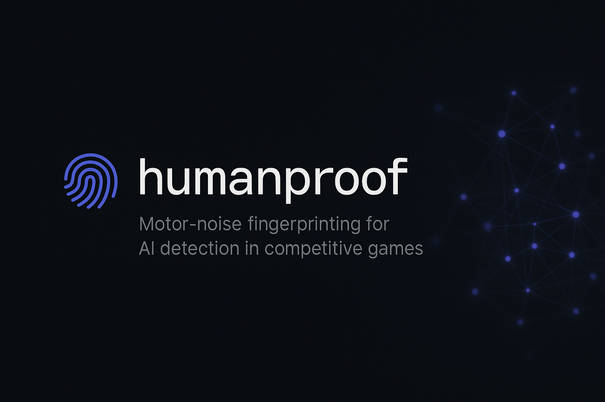
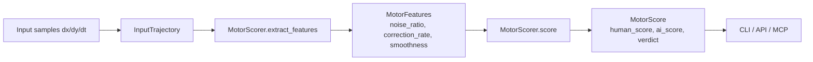

# humanproof

[](https://badge.fury.io/py/humanproof)
[](https://github.com/sandeep-alluru/humanproof/actions/workflows/ci.yml)
[](https://codecov.io/gh/sandeep-alluru/humanproof)
[](https://python.org)
[](LICENSE)
[](https://pypistats.org/packages/humanproof)
[](src/humanproof/py.typed)



> **77 tests · 95% coverage** — motor-noise fingerprinting for AI detection in competitive games.

**Navigation:** [Why](#why) · [How it works](#how-it-works) · [Features](#features) · [Install](#install) · [Quick Start](#quickstart) · [CLI](#cli) · [REST API](#rest-api) · [MCP / Claude](#mcp--claude) · [OpenAI](#openai-function-calling) · [GitHub Action](#github-action) · [vs Alternatives](#alternatives) · [Repo tree](#repository-tree) · [Star history](#star-history)

---

## Why

AI agents in competitive gaming (FPS, RTS, MOBAs) produce unnaturally smooth input — near-zero jitter, no micro-corrections, perfectly consistent velocity. humanproof quantifies this difference with a lightweight pure-Python library that requires no ML models.

## How it works



## Features

| Feature | Description |
|---|---|
| Minimal dependencies (click, rich only) | No numpy, no scikit-learn — just two lightweight CLI/display packages |
| No training data | Threshold-based heuristics, works out of the box |
| Multiple interfaces | CLI, FastAPI REST server, MCP for Claude |
| SQLite persistence | Stores trajectories and scores locally |
| 77 pytest tests | 95% coverage, fully typed |
| MCP tools | `score_trajectory`, `batch_score`, `list_scores` for Claude |
| OpenAI functions | JSON definitions in `tools/openai-tools.json` |
| GitHub Action | `sandeep-alluru/humanproof@v0.1.0` |

Key discriminating features:

| Signal | Human | AI |
|---|---|---|
| `noise_ratio` (std/mean speed) | 0.4 – 0.8 | 0.05 – 0.2 |
| `correction_rate` (reversals/sample) | 0.15 – 0.35 | < 0.05 |
| `smoothness` (1/mean_jerk) | < 5.0 | > 8.0 |

## Install

> **Note:** PyPI publication is pending. Install directly from GitHub:
> ```bash
> pip install git+https://github.com/sandeep-alluru/humanproof.git
> ```

```bash
pip install humanproof
pip install "humanproof[api]"   # + FastAPI server
pip install "humanproof[mcp]"   # + MCP server for Claude
```

## Quickstart

```python
from humanproof import InputSample, InputTrajectory, MotorScorer

samples = [InputSample(dx=3.0, dy=2.0, dt=10.0) for _ in range(20)]
traj = InputTrajectory(samples=samples)
scorer = MotorScorer()
result = scorer.score(traj)
print(result.verdict, result.human_score)
```

## CLI

| Command | Description |
|---|---|
| `humanproof score <file>` | Score a single JSON trajectory file |
| `humanproof batch <dir>` | Score all JSON files in a directory |
| `humanproof batch-csv <csv>` | Score trajectories from a CSV file (columns: trajectory_id, t, x, y, button) |
| `humanproof session <csv>` | Analyze a session CSV for behavioral shifts across trajectories |
| `humanproof log` | List all stored scores |
| `humanproof status` | Show count of stored data |

```bash
humanproof score trajectory.json
humanproof batch ./trajectories/
humanproof log
humanproof status
```

## REST API

```bash
pip install "humanproof[api]"
uvicorn humanproof.api:app --reload

curl -X POST http://localhost:8000/score -H 'Content-Type: application/json' \
  -d '{"samples": [{"dx":1,"dy":1,"dt":10}]}'
```

Endpoints: `GET /health` · `POST /score` · `POST /batch` · `GET /scores`

## MCP / Claude

Add to Claude Desktop config (`~/.config/claude/claude_desktop_config.json`):

```json
{
  "mcpServers": {
    "humanproof": {
      "command": "humanproof-mcp"
    }
  }
}
```

Tools available: `score_trajectory`, `batch_score`, `list_scores`.

## OpenAI Function Calling

Function definitions are in [`tools/openai-tools.json`](tools/openai-tools.json):

```python
import json, openai
tools = json.load(open("tools/openai-tools.json"))
response = openai.chat.completions.create(
    model="gpt-4o",
    tools=tools,
    messages=[{"role": "user", "content": "Is this input human?"}]
)
```

## GitHub Action

```yaml
- uses: sandeep-alluru/humanproof@v0.1.0
  with:
    trajectory-file: replay.json
```

## Alternatives

| Tool | Approach | humanproof advantage |
|---|---|---|
| VAC / EasyAntiCheat | Memory scanning | No kernel driver needed |
| ML classifiers | Requires training data | Zero-shot, no model required |
| Replay analysis tools | Manual review | Automated, scriptable API |
| Kernel-level drivers | OS-level hooks | Pure Python, cross-platform |

## Repository tree

```
humanproof/
├── src/humanproof/       # library source
│   ├── trajectory.py     # InputSample, InputTrajectory
│   ├── scorer.py         # MotorFeatures, MotorScore, MotorScorer
│   ├── store.py          # SQLite persistence
│   ├── report.py         # Rich / JSON / Markdown output
│   ├── cli.py            # Click CLI
│   ├── api.py            # FastAPI server
│   └── mcp_server.py     # MCP server
├── tests/                # 77 pytest tests, 95% coverage
├── examples/
│   ├── demo.py                          # end-to-end demo
│   ├── game_anticheat.py                # game anti-cheat integration example
│   ├── esports_integrity_monitor.py     # esports session integrity monitor
│   └── claude_computer_use_detection.py # Claude computer-use AI detection
├── docs/                 # 11-page MkDocs site
└── tools/openai-tools.json
```

## Star history

[](https://star-history.com/#sandeep-alluru/humanproof)

> Add topics to this repo: `gaming` `anti-cheat` `motor-fingerprinting` `ai-detection` `python`

## Real-World Scenario

**Esports: Detecting AI Aimbot in Tournament Play**

A tournament operator reviews replay data for a suspected aimbot. The player's mouse trajectory is unnaturally smooth — no micro-corrections, no velocity variance. humanproof flags it in under 100ms with no ML model required:

```python
from humanproof import InputSample, InputTrajectory, MotorScorer

# Human player trajectory — realistic noise, varied timing (dt 8–12ms)
human_deltas = [
    (3.1, 2.4, 9.0), (-1.2, 3.8, 11.0), (4.7, -0.9, 8.0), (2.3, 5.1, 10.0),
    (-0.8, 2.7, 12.0), (5.2, -1.4, 9.0), (1.9, 4.3, 10.0), (-2.6, 0.8, 8.0),
    (3.8, -3.1, 11.0), (0.4, 6.2, 9.0), (-1.7, 2.9, 10.0), (4.1, 0.3, 12.0),
    (2.8, -2.2, 8.0), (-0.5, 4.8, 10.0), (3.4, 1.7, 9.0), (1.1, -3.6, 11.0),
    (5.0, 2.1, 10.0), (-2.9, 3.5, 8.0), (0.7, -1.8, 12.0), (4.4, 2.6, 9.0),
]
human_samples = [InputSample(dx=dx, dy=dy, dt=dt) for dx, dy, dt in human_deltas]

# AI bot trajectory — unnaturally smooth, perfectly consistent timing (dt=16ms exactly)
bot_deltas = [
    (2.0, 2.0, 16.0), (2.0, 2.0, 16.0), (2.0, 2.0, 16.0), (2.0, 2.0, 16.0),
    (2.0, 2.0, 16.0), (2.0, 2.0, 16.0), (2.0, 2.0, 16.0), (2.0, 2.0, 16.0),
    (2.0, 2.0, 16.0), (2.0, 2.0, 16.0), (2.0, 2.0, 16.0), (2.0, 2.0, 16.0),
    (2.0, 2.0, 16.0), (2.0, 2.0, 16.0), (2.0, 2.0, 16.0), (2.0, 2.0, 16.0),
    (2.0, 2.0, 16.0), (2.0, 2.0, 16.0), (2.0, 2.0, 16.0), (2.0, 2.0, 16.0),
]
bot_samples = [InputSample(dx=dx, dy=dy, dt=dt) for dx, dy, dt in bot_deltas]

scorer = MotorScorer()

human_result = scorer.score(InputTrajectory(samples=human_samples))
bot_result   = scorer.score(InputTrajectory(samples=bot_samples))

print(f"[Player]  verdict={human_result.verdict}  human_score={human_result.human_score:.2f}  ai_score={human_result.ai_score:.2f}")
print(f"[Bot]     verdict={bot_result.verdict}  human_score={bot_result.human_score:.2f}  ai_score={bot_result.ai_score:.2f}")

if bot_result.verdict == "AI":
    print("\nFLAGGED: Suspected aimbot detected — trajectory referred to tournament integrity committee.")
```

**What this catches that traditional anti-cheat misses:** Memory scanners require OS-level access and are bypassed by external AI controllers. humanproof works on replay data alone — usable post-match for dispute resolution, with no kernel driver required.

## Case Studies

See how teams are using humanproof in production:

- [Behavioral Anti-Cheat for Competitive Esports](docs/case-studies/gaming-anticheat-esports.md) — IronLadder detects 847 cheaters in 30 days with 0.3% false positive rate
- [Separating Real Users from AI Agents in Web Analytics](docs/case-studies/web-bot-detection-saas.md) — Veridian Analytics quarantines 94% of bot traffic across 500 e-commerce clients

## License

MIT — see [LICENSE](LICENSE).
