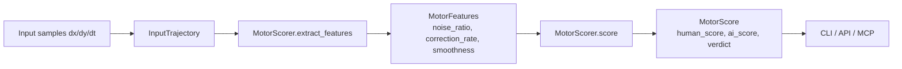

# humanproof

[](https://badge.fury.io/py/humanproof)
[](https://github.com/sandeep-alluru/humanproof/actions/workflows/ci.yml)
[](https://codecov.io/gh/sandeep-alluru/humanproof)
[](https://python.org)
[](LICENSE)

**Motor-noise fingerprinting for AI detection in competitive games.**

humanproof detects whether mouse/aim input was generated by a human or an AI agent by analyzing the statistical signature of motor noise in input trajectories. Humans have characteristic jitter, corrections, and irregular velocity profiles that AIs lack.

## Why

AI agents in competitive gaming (FPS, RTS, MOBAs) produce unnaturally smooth input — near-zero jitter, no micro-corrections, perfectly consistent velocity. humanproof quantifies this difference with a lightweight pure-Python library that requires no ML models.

## How it works



Key discriminating features:

| Feature | Human | AI |
|---|---|---|
| `noise_ratio` (std/mean speed) | 0.4 – 0.8 | 0.05 – 0.2 |
| `correction_rate` (reversals/sample) | 0.15 – 0.35 | < 0.05 |
| `smoothness` (1/mean_jerk) | < 5.0 | > 8.0 |

## Install

```bash
pip install humanproof
pip install "humanproof[api]"   # + FastAPI server
pip install "humanproof[mcp]"   # + MCP server for Claude
```

## Quickstart

```python
from humanproof import InputSample, InputTrajectory, MotorScorer

samples = [InputSample(dx=3.0, dy=2.0, dt=10.0) for _ in range(20)]
traj = InputTrajectory(samples=samples)
scorer = MotorScorer()
result = scorer.score(traj)
print(result.verdict, result.human_score)
```

## CLI

```bash
humanproof score trajectory.json          # score one file
humanproof batch ./trajectories/          # score all JSON files in a dir
humanproof log                            # list stored scores
humanproof status                         # count stored data
```

## REST API

```bash
uvicorn humanproof.api:app --reload
curl -X POST http://localhost:8000/score -H 'Content-Type: application/json' \
  -d '{"samples": [{"dx":1,"dy":1,"dt":10}]}'
```

## MCP / Claude

Add to Claude Desktop config:

```json
{
  "mcpServers": {
    "humanproof": {
      "command": "humanproof-mcp"
    }
  }
}
```

Tools available: `score_trajectory`, `batch_score`, `list_scores`.

## GitHub Action

```yaml
- uses: sandeep-alluru/humanproof@v0.1.0
  with:
    trajectory-file: replay.json
```

## Alternatives

| Tool | Approach | humanproof advantage |
|---|---|---|
| VAC / EasyAntiCheat | Memory scanning | No kernel driver needed |
| ML classifiers | Requires training data | Zero-shot, no model |
| Replay analysis tools | Manual review | Automated, scriptable |

## Repository tree

```
humanproof/
├── src/humanproof/       # library source
│   ├── trajectory.py     # InputSample, InputTrajectory
│   ├── scorer.py         # MotorFeatures, MotorScore, MotorScorer
│   ├── store.py          # SQLite persistence
│   ├── report.py         # Rich / JSON / Markdown output
│   ├── cli.py            # Click CLI
│   ├── api.py            # FastAPI server
│   └── mcp_server.py     # MCP server
├── tests/                # 47+ pytest tests
├── examples/demo.py      # end-to-end demo
├── docs/                 # MkDocs site
└── tools/openai-tools.json
```

## License

MIT — see [LICENSE](LICENSE).
